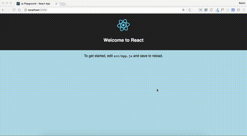

# js-playground



a gitignored javascript (react/ES6) playground for testing node modules, and random ideas. Also has support for sass

The Docs / README containing awesome project tips can be found at the [create-react-app README](./docs/create-react-app.readme.md)

## Getting Started

Simply clone the project:

```
git clone https://github.com/torch2424/js-playground.git
```

To make changes to the project itself, for Pull Requests and things, be sure to uncomment the following from the .gitignore. Example:

```
# Gitignore the entire project
# Comment the below lines to make changes to the project
# *
# **/*
```

## Usage

Simply add a random node module to the project

```
npm install --save pretty-bytes
```

And notice how it will not detect any changes!

To reset back to the latest master:

```
git fetch
git reset --hard origin/master
```

## LICENSE

LICENSE under [Apache 2.0](https://choosealicense.com/licenses/apache-2.0/)
